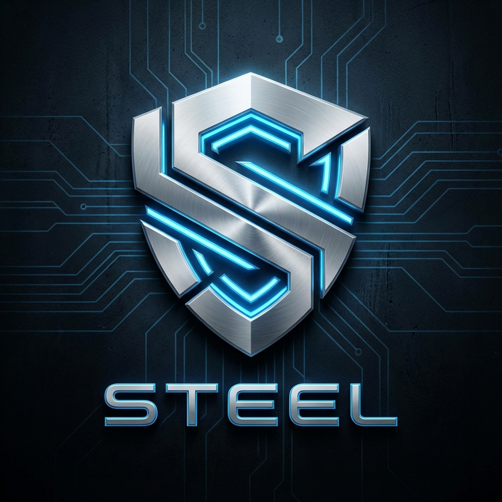

# STEEL OS | AI COMMAND CENTER (v6.5)
*Premium Glass UI with Living AI Core*



## 🌟 Overview
Steel is a Python-based desktop AI assistant featuring a **holographic glass UI** inspired by BMW iDrive, Apple Vision Pro, and Jarvis-style system interfaces. It combines powerful voice AI with a visually stunning, state-reactive dashboard.

### Design Philosophy
- **Glass-OS Aesthetic**: Light frosted panels floating on atmospheric backgrounds
- **Living AI Core**: State-driven orb with specular highlights and audio waveforms
- **System Language**: IT-native naming (Cognitive Core, Voice Interface, Runtime)
- **Micro-Information**: Every element answers "why should I look at you?"

## 🛠️ Technology Stack
| Layer | Technology |
|-------|------------|
| Backend | Python 3.10+, PySide6 (Qt 6) |
| Frontend | QML (Qt Quick) |
| AI Engine | Google Gemini 1.5 Pro |
| State | QObject Signals/Properties |

## 📦 Quick Start
```batch
# 1. Clone
git clone https://github.com/MrRenntech/Steel.git
cd Steel

# 2. Install dependencies
prereq.bat
# Or: pip install -r Readme\requirements.txt

# 3. Configure
copy .env.example .env
# Add your GEMINI_API_KEY to .env

# 4. Launch
run.bat
# Or: cd app && python main.py
```

## 🎨 Visual Features

### 3-Zone Layout
```
┌─────────────────────────────────────────────┐
│ TOP SYSTEM BAR (status / time / tabs)       │
├─────────────────────────────────────────────┤
│ LEFT (65%)         │ RIGHT (35%)            │
│ Information Grid   │ AI Core Orb            │
│ - Cognitive Core   │ - 5-layer depth        │
│ - Voice Interface  │ - State-driven motion  │
│ - Runtime          │ - Audio waveform       │
│ - Connectivity     │ - Specular highlights  │
├─────────────────────────────────────────────┤
│ BOTTOM CONTEXT BAR (hints / mic / version)  │
└─────────────────────────────────────────────┘
```

### Living Orb States
| State | Visual |
|-------|--------|
| IDLE | Calm breathing, subtle 4px drift |
| LISTENING | Cyan glow, audio waveform bars, pulsing |
| THINKING | Amber glow, rotating depth ring |
| RESPONDING | Green pulse, outward field expansion |

### Curated Wallpapers
- Ambient Sky (default)
- Soft Horizon
- Glass Fog
- Warm Dawn

## 📖 Documentation
- **[HOW_TO.txt](Readme/HOW_TO.txt)** — Complete technical reference for interviews
- **[.env.example](.env.example)** — Environment variable template

## 🎮 Usage
1. Click the **AI Orb** to activate voice input
2. Speak naturally: *"What's the weather?"*, *"Analyze my screen"*
3. Watch the orb transition through states
4. Click **Environment** tile to change wallpaper

## 📁 Project Structure
```
Steel/
├── app/
│   ├── main.py           # Entry point
│   ├── core/             # AI engine, state management
│   │   └── app_state.py  # Reactive state with Qt signals
│   ├── ui/
│   │   ├── main.qml      # 3-zone layout
│   │   ├── components/   # CoreVisual, GlassTile, BackgroundField
│   │   └── panels/       # AssistantPanel, WallpaperPanel
│   └── themes/           # BMW-inspired themes
├── Readme/              # Documentation folder
│   ├── HOW_TO.txt        # Technical deep-dive
│   ├── project_tree.txt  # Full directory tree
│   └── requirements.txt  # Dependencies
├── run.bat               # Launch script
└── prereq.bat            # Dependency installer
```

## 📝 Changelog
- **v6.5** — 4-Phase Visual Overhaul
  - Locked 3-zone layout (Top/Main/Bottom)
  - Bottom context bar with mic level
  - System naming (Cognitive Core, etc.)
  - State-driven orb with 5 layers
  - Audio waveform visualization
  
- **v6.4** — Command Center Refactor
  - Wallpaper switching system
  - True glass panels
  - Background parallax

## 📝 License
Open Source (MIT). Built for the community.

---
*v6.5 — Living Glass UI | December 2024*
